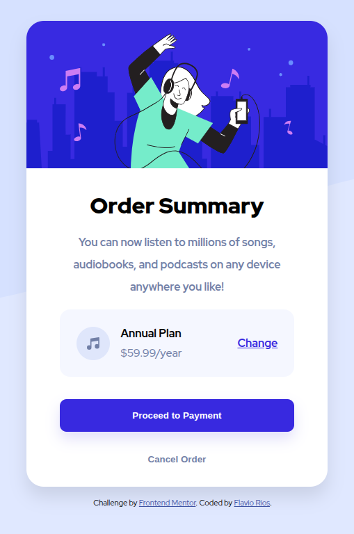

# Frontend Mentor - Order summary card solution

This is a solution to the [Order summary card challenge on Frontend Mentor](https://www.frontendmentor.io/challenges/order-summary-component-QlPmajDUj). Frontend Mentor challenges help you improve your coding skills by building realistic projects. 

## Table of contents

- [Overview](#overview)
  - [The challenge](#the-challenge)
  - [Screenshot](#screenshot)
  - [Links](#links)
- [My process](#my-process)
  - [Built with](#built-with)
  - [What I learned](#what-i-learned)
  - [Continued development](#continued-development)
  - [Useful resources](#useful-resources)
- [Author](#author)

## Overview

### The challenge

Users should be able to:
- View the optimal layout depending on their device's screen size
- See hover states for interactive elements

### Screenshot



### Links

- Solution URL: [GitHub.com](https://github.com/flaviovich/frontendmentor-order-summary-card)
- [Live Site](https://flaviovich.github.io/frontendmentor-order-summary-card/)

## My process

### Built with

- Semantic HTML5 markup
- CSS custom properties
- CSS media queries
- Flexbox
- Mobile-first workflow

### What I learned

While working on this project, I deepened my understanding of several CSS concepts:

**CSS Custom Properties (CSS Variables):**
I learned to effectively use CSS variables for consistent theming and easier maintenance:

```css
:root {
  --blue-50: hsl(225, 100%, 98%);
  --blue-100: hsl(225, 100%, 94%);
  --blue-700: hsl(245, 75%, 52%);
  --blue-950: hsl(223, 47%, 23%);
  --gray-600: hsl(224, 23%, 55%);
  --shadow-color: rgba(56, 41, 224, 0.15);
}
```

**Responsive Design with Mobile-First Approach:**
I implemented a mobile-first workflow, starting with mobile styles and using media queries for larger screens:

```css
/* Mobile styles first */
body {
  background-image: url(/assets/images/pattern-background-mobile.svg);
}

/* Desktop styles */
@media (width > 375px) {
  body {
    background-image: url(/assets/images/pattern-background-desktop.svg);
  }
}
```

**Flexbox Layout:**
I used Flexbox extensively for creating responsive layouts and centering content:

```css
.plan-container {
  display: flex;
  align-items: center;
  justify-content: space-between;
  background-color: var(--blue-50);
  border-radius: 15px;
  padding: 1rem;
}
```

**Interactive States:**
I implemented hover and active states for better user experience:

```css
.plan-change:hover {
  color: hsl(245, 75%, 65%);
  text-decoration: none;
  font-weight: 500;
}

.btn-primary:hover {
  background-color: hsl(245, 75%, 65%);
}
```

### Continued development

In future projects, I want to focus on:

- Improving my CSS Grid skills for more complex layouts
- Exploring CSS animations and transitions in more depth
- Implementing more advanced responsive design techniques
- Learning CSS methodologies like BEM for better code organization
- Improving accessibility practices in my projects

### Useful resources

- [HSL Color Picker](https://www.hslpicker.com/) - This interactive tool was crucial for easily visualizing and adjusting the HSL color values (hue, saturation, lightness) defined in my `:root` variables, ensuring a perfect color scheme.

## Author

- Website - [Flavio Rios](https://github.com/flaviovich)
- Frontend Mentor - [@flaviovich](https://www.frontendmentor.io/profile/flaviovich)
- Twitter - [@flaviovichDev](https://www.twitter.com/flaviovichDev)
